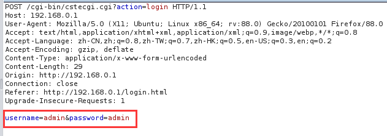

# TOTOLINK Vulnerability

Vendor:TOTOLINK

Product:X5000R

Version:X5000R_Firmware(V9.1.0u.6118_B20201102)

Type:Leakage of sensitive information

Author:Jiaqian Peng,Huizhao Wang

Institution:pengjiaqian@iie.ac.cn,wanghuizhao@iie.ac.cn

## Vulnerability description

We found an stack overflow vulnerability in TOTOLINK Technology router with firmware which was released recentl, allows remote attackers to crash the server.

**Leakage of sensitive information**

The router does not default-ly use HTTPS for logging into its admin interface. This fact means that communication between it and the user during administrative tasks are not encrypted. 

The design flaw can be seen by capturing the packets from your web browser to your router using something like Burp.

**Supplement**

Many products will be affected, we suggest that encrypt the user name and password and then transmit them.

## PoC

## Result

The implications are that if anyone is sniffing your network while you log in administratively to your router or gains immediate access to your computer after log in they will be able to acquire your admin password.
